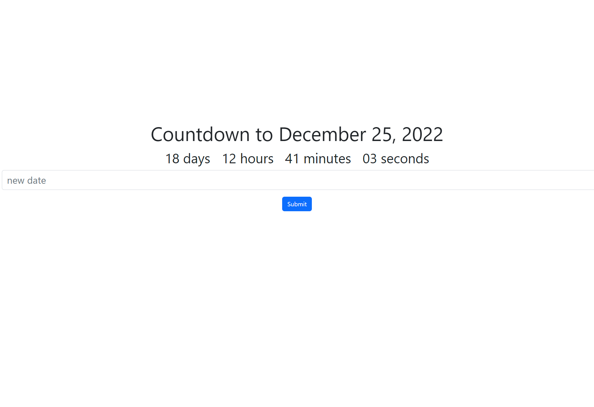

# CountDown_React
To open this application follow these instructions.  

type this cammand(s) in the bash terminal:

1. cd my-app
2. pip3 install -r requirements.txt
3. npm install
4. npm start

# What dose this application do? 
* This app counts down to a selected date currently the default date is Christmas but the date can be changed by the user at any time using the input field. 

